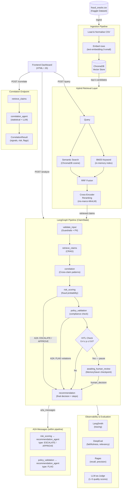

# System Architecture

## High-Level Overview

```
┌─────────────────────────────────────────────────────────────────────────┐
│                     Insurance Claims Intelligence System                │
│                                                                         │
│  ┌──────────────┐     ┌──────────────────────────────────────────────┐ │
│  │   Frontend   │────▶│              FastAPI Gateway                 │ │
│  │  (HTML/JS)   │◀────│  /ingest  /query  /analyze  /correlate      │ │
│  └──────────────┘     └──────────────────────────────────────────────┘ │
│                                       │                                 │
│              ┌────────────────────────┼────────────────────┐           │
│              ▼                        ▼                    ▼           │
│  ┌──────────────────┐   ┌─────────────────────┐  ┌──────────────────┐ │
│  │ Ingestion        │   │  Hybrid Retrieval   │  │  LangGraph       │ │
│  │ Pipeline         │   │  Layer              │  │  Multi-Agent     │ │
│  │                  │   │                     │  │  Pipeline        │ │
│  │ CSV → Embed      │   │  BM25 (keyword)     │  │                  │ │
│  │ → ChromaDB       │   │  + Semantic         │  │  5 Agents +      │ │
│  │                  │   │  + Cross-Encoder    │  │  HITL + A2A      │ │
│  └──────────────────┘   │    Reranking        │  └──────────────────┘ │
│                         └─────────────────────┘                        │
└─────────────────────────────────────────────────────────────────────────┘
```

---

## Mermaid Diagram



---

## Component Details

### 1. Ingestion Pipeline (`ingestion/ingest.py`)

| Step | Detail |
|------|--------|
| Input | `fraud_oracle.csv` — 15,420 vehicle insurance claim records |
| Normalisation | Column name lowercasing, type coercion, null handling |
| Document format | Structured text per row including all key fields |
| Embedding model | `text-embedding-3-small` via OpenAI-compatible gateway |
| Vector store | ChromaDB with cosine similarity, persisted to `./data/chroma_db` |
| Batch size | 100 documents per ChromaDB upsert |
| Metadata stored | `fraud_label`, `policy_type`, `accident_type`, `claim_amount`, `customer_region`, `incident_date`, `claim_status` |

---

### 2. Hybrid Retrieval Layer (`retrieval/retriever.py`)

```
Query
  │
  ├── Semantic search  →  ChromaDB cosine similarity (top fetch_k × 3 candidates)
  │
  └── BM25 search      →  BM25Okapi on stored document corpus
         │
         └── RRF Fusion  (score = Σ 1/(60 + rank_i))
                │
                └── Cross-Encoder Reranking  (ms-marco-MiniLM-L-6-v2)
                       │
                       └── Top-k results returned
```

**Why RRF?** Reciprocal Rank Fusion combines ranked lists from different retrievers without requiring score normalisation. It is robust when the two retrievers produce very different score magnitudes.

---

### 3. Multi-Agent Pipeline (`pipeline/graph.py`)

The LangGraph state machine manages a `ClaimState` TypedDict that flows through five specialised nodes:

| Node | Agent | Purpose |
|------|-------|---------|
| `validate_input` | Guardrails | Length check, injection detection, PII redaction |
| `retrieve_claims` | Fraud Retrieval (CRAG) | Hybrid retrieval; auto-refines query if confidence < 0.30 |
| `correlation` | Correlation Agent | Cross-claim pattern detection (statistical + LLM) |
| `risk_scoring` | Risk Scoring Agent | LLM-based fraud probability (0–1); posts A2A messages |
| `policy_validation` | Policy Validation Agent | Compliance checks; posts A2A FLAG messages |
| `hitl_check` | — | Pause if `0.4 ≤ fraud_prob ≤ 0.6` |
| `recommendation` | Recommendation Agent | Final decision; reads A2A messages + correlation signals |

---

### 4. A2A Communication (`agents/a2a_protocol.py`)

Agents communicate via typed messages stored in `ClaimState.a2a_messages`:

```
risk_scoring_agent ──ESCALATE──▶ recommendation_agent   (when fraud_prob > 0.6)
risk_scoring_agent ──APPROVE───▶ recommendation_agent   (when fraud_prob < 0.4)
risk_scoring_agent ──FLAG──────▶ recommendation_agent   (when correlation risk HIGH/CRITICAL)
policy_validation  ──FLAG──────▶ recommendation_agent   (when policy violations found)
```

Messages are serialised dicts so they survive LangGraph's MemorySaver checkpointing.

---

### 5. HITL Checkpointing

When `fraud_probability` falls in the uncertainty band `[0.4, 0.6]`, the graph pauses before the `awaiting_human_review` node using `interrupt_before`. The in-memory `MemorySaver` preserves state. The `/analyze/resume` endpoint injects `human_decision` and resumes the graph.

---

### 6. Correlation Endpoint (`/correlate`)

Standalone endpoint that retrieves a larger set of claims (up to 50) and runs:
1. **Statistical pre-filter** — rule-based checks for region hotspots, repeat customers, amount clustering, and fraud density.
2. **LLM correlation analysis** — GPT-4o-mini identifies REPEAT_CUSTOMER, REGION_HOTSPOT, AMOUNT_CLUSTER, TEMPORAL_BURST, and PATTERN_MATCH signals.

---

### 7. Observability

| Tool | Purpose |
|------|---------|
| LangSmith | Full LLM call tracing, latency, token usage |
| DeepEval | Faithfulness ≥ 0.7, AnswerRelevancy ≥ 0.7, ContextualPrecision ≥ 0.6 |
| Ragas | Faithfulness, AnswerRelevancy, ContextRecall |
| LLM-as-Judge | Scores each response 1–5 on faithfulness, helpfulness, accuracy |
